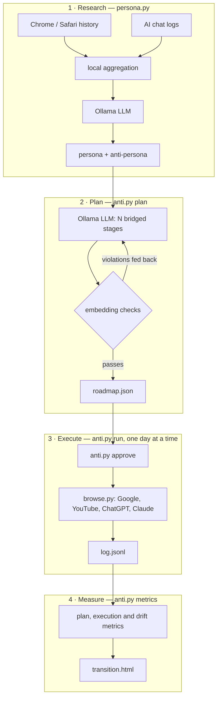

# anti-persona

[](https://github.com/tonoyandev/web3lesson/actions/workflows/ci.yml)


**Part 1** is all you need to use the tool. **Part 2** explains how it works
inside, including the math.

---

# Part 1. Quick guide

## What it does

Your browser history and AI chats say a lot about you. This tool reads them on
your own computer and asks a local AI model two questions: *who is this
person?* and *who is their opposite?*

Then it plans a slow trip from you to your opposite, in small steps. For
example: *coding → how to relax after work → house plants → gardening → living
in nature*.

Once you approve the plan, it opens Chrome once a day and browses like a person
at that step would. It runs Google searches, watches YouTube videos, and asks
ChatGPT and Claude questions. It also measures whether the change is really
happening.

Nothing leaves your computer. The AI model runs locally with
[Ollama](https://ollama.com).

## What you need

- Python 3.10 or newer
- Google Chrome
- [Ollama](https://ollama.com)
- About 18 GB of free disk space for the default model. A smaller model works too, see below.

## Install

```bash
git clone https://github.com/tonoyandev/web3lesson.git anti-persona
cd anti-persona
pip3 install -r requirements.txt
ollama pull qwen3.8
ollama pull nomic-embed-text
```

## Easiest way: the app

After installing, double-click:

- **macOS:** `Start.command`
- **Windows:** `Start.bat`

A page opens in your browser with every step as a button, in order. Each step
shows whether it is done, and the output of each button appears at the bottom.
It also checks your setup, and missing models can be downloaded with one click.

The first time on macOS, right-click `Start.command` and choose **Open**,
because the file is not signed. You can also start the app from a terminal with
`python3 app.py`.

The app only listens on your own computer and uses a secret address that
changes every time you start it.

## Or use the terminal

**1. Learn who you are.** The tool first shows what it will read and asks for
permission. Then it opens a report in your browser.

```bash
python3 persona.py
```

**2. Make the plan.** This is slow. Each attempt takes about 20 minutes with the
default model.

```bash
python3 anti.py plan
```

Want a specific destination instead of the mirror image? Tell it:

```bash
python3 anti.py plan --goal "house plants, gardening, living in nature"
```

**3. Read and approve the plan.** Nothing runs on its own until you do this.

```bash
python3 anti.py approve
```

**4. Log in once.** A separate Chrome window opens. Log in to Google, ChatGPT
and Claude yourself. The tool never sees your passwords.

```bash
python3 anti.py login
```

**5. Run one day.** First see what it would do, then run it for real.

```bash
python3 anti.py run --dry-run
```

```bash
python3 anti.py run
```

**6. Check progress.** This opens a dashboard with charts.

```bash
python3 anti.py metrics --judge
```

**7. Optional: make it automatic.** From now on it runs one day every evening.

```bash
python3 anti.py schedule --at 20:00
```

## How long it takes

The default plan has 10 steps, and each step lasts 5 days. That is about seven
weeks. Real people change slowly, so a slow change looks natural. You can make
each step shorter or longer:

```bash
python3 anti.py plan --check --days-per-stage 3
```

## Smaller computer?

Use a smaller model. Add `--model` to the commands:

| Model | Download size | Speed and quality |
|---|---|---|
| `qwen3.8` (default) | 17 GB | best plans, slowest |
| `qwen3:14b` | 9 GB | good balance |
| `qwen3:8b` | 5 GB | fastest, needs more retries |

```bash
python3 anti.py plan --model qwen3:8b
```

## Please read before you use it

- **Only use it on your own computer and your own accounts.**
- **ChatGPT and Claude do not allow bots in their websites.** Your accounts
  could be flagged. To skip them, add `--only google,youtube` to `run`.
- **The tool never tricks security checks.** If a website shows a CAPTCHA or a
  login page, it stops the run and leaves it to you.
- **It uses its own Chrome profile.** Your normal Chrome and its history stay
  untouched.

## Stop or start over

Stop the daily runs:

```bash
python3 anti.py schedule --remove
```

To start over completely, also delete the `out/` and `state/` folders and
`~/.anti/`.

---

# Part 2. How it works

## The pipeline



## 1. Research

`persona.py` reads these sources and never changes them:

- Chrome history on macOS, Linux and Windows, plus extra profiles with `--chrome-history`
- Safari history on macOS
- Claude Code chats in `~/.claude/projects`
- a ChatGPT data export, with `--extra DIR`

The model never sees your raw history. The tool first boils it down to a
summary: top domains, page titles, search terms, the hours you are active,
keywords, and 30 short prompt samples. Only that summary goes to the model.

The prompt tells the model three things. Browser history describes your whole
life, while AI chats mostly describe your job. Every claim needs evidence from
the data. The opposite must flip each trait one to one.

## 2. Planning

The model writes all stages in one go. It sees the whole trip at once, which
helps keep an even pace. Two rules guide it:

- **Bridge rule.** Each stage shares one concrete thing with the stage before
  it, and adds one new thing that moves toward the goal.
- **Pace rule.** Stage *k* should be *(k−1)/(N−1)* of the way, so stage 1 is 0%
  and stage 10 is 100%.

The tool then checks the plan with the measurements below. If a check fails, it
tells the model exactly what went wrong, for example "stage 3 sits at 49% of the
way, target 22%". It tries up to 3 times and keeps the best plan.

## 3. The math

Every text is turned into a vector with `nomic-embed-text`. The persona's
interests and the opposite's interests are two points. The line between them is
an **axis**. Any text gets a **position** on that axis, where 0 is you and 1 is
your opposite.

For unit vectors, with `e` the text, `p` the persona centre and `a` the opposite
centre:

```
t(e) = (cos(e,a) − cos(e,p)) / (2·(1 − cos(p,a))) + 0.5
```

This is the projection of `e` onto the line from `p` to `a`. The result is then
rescaled, so that your own interest phrases average 0 and the opposite's
average 1.

### Plan checks

| Check | What it means | Target |
|---|---|---|
| neighbour similarity | how alike two neighbouring stages are | higher than the first and last stage's similarity + 0.05 |
| max step | the biggest jump between two neighbours | at most 2/(N−1) |
| backslides | stages that move back toward you by more than 0.05 | 0 |
| coverage | share of the opposite's interests reached in the second half, with a cosine of at least 0.55 | at least 70% |

**Why the similarity check is relative.** Lists of search queries always look
alike to an embedding model. Neighbours score above 0.8 even in a bad plan, so a
fixed threshold would never fail. Instead, neighbours must be clearly closer
than the start is to the finish.

### Run checks

| Check | What it means | Target |
|---|---|---|
| execution rate | actions that worked, out of actions tried | at least 0.9 |
| challenge rate | runs stopped by a login page or bot check | 0 |
| observed position | position of what was really seen: page titles and chat replies | follows the plan line |
| judge progress | a separate model call reads only the automation profile's history, names 6 interests, and places them on the axis | at least 0.6 at the end |

**Why drift is not measured by re-running the research.** Your main history
barely changes, and a model gives slightly different answers every time. That
noise is bigger than ten days of real drift. The judge looks only at the
automation profile, so it measures just the change the tool made.

## 4. Pacing

- Day 1 of a stage uses the plan's own actions.
- Every later day, the model rewords the stage once. The topic stays the same,
  the wording and angle are new, and the number of actions is kept. The new
  wording is saved in `state/variants.json`, so a retry repeats it exactly.
- At most one day runs every 12 hours. A day is about 11 actions and takes
  10–15 minutes.
- Typing takes 60–180 ms per key, and reading takes 20–90 seconds per page.

A Google account that is logged in to both your normal browser and the
automation profile sees both. The change only looks complete once your own
habits change too.

## 5. State and safety details

- **The log is the progress.** `state/log.jsonl` records every action. A run
  that stops halfway continues where it stopped, and it never repeats a
  finished action. An action that fails twice is skipped, so one broken site
  cannot block the plan.
- **Approval is tied to the plan.** The plan's id is a hash of its stages.
  Editing a stage cancels the approval. Changing only the pace keeps it.
- **One run at a time.** A lock file, `~/.anti/run.lock`, stops two runs from
  opening the same Chrome profile, which would corrupt it. A lock left by a
  crash is cleaned up automatically.
- **History copies are temporary.** History databases are copied to a private
  temp folder together with their journal and WAL files, read in read-only mode,
  and then deleted.
- **Untrusted text.** Page titles come from websites. They are passed to the
  model as quoted data, with an instruction to ignore any commands inside. Both
  HTML reports escape every value, so a bad page title cannot run code.
- **About bot detection.** Chrome starts without the "controlled by automated
  software" banner and without the `navigator.webdriver` flag. Nothing else is
  done: no fingerprint spoofing, no proxies, no CAPTCHA solving.
- **Remote model warning.** If `--host` points to another computer, the tool
  warns you, because your summary would then leave your machine.
- **Permissions.** `~/.anti` holds your logins and is set to `chmod 700`.

## Files it writes

| Path | What is inside |
|---|---|
| `out/summary.json` | the research summary |
| `out/persona.json` | you and your opposite |
| `out/report.html` | research dashboard |
| `out/transition.html` | progress dashboard |
| `state/roadmap.json` | the plan and its scores; old plans are kept as `roadmap-<id>.json` |
| `state/log.jsonl` | every action and its result |
| `state/variants.json` | the daily rewordings |
| `state/metrics.jsonl` | one line per measurement |
| `~/.anti/profile/` | the automation Chrome profile |

`out/` and `state/` hold personal data and are git-ignored.

## All commands

### `persona.py`

| Flag | What it does |
|---|---|
| `--yes` | skip the permission question |
| `--extra DIR` | add a ChatGPT data export |
| `--chrome-history FILE` | add another Chrome profile; can be repeated |
| `--model NAME` | Ollama model; default `qwen3.8:latest` |
| `--host URL` | Ollama address; default `http://localhost:11434` |
| `--lang LANG` | language of the report; default English |
| `--no-llm` | only statistics and charts |
| `--out DIR` | output folder; default `out/` next to the script |
| `--selftest` | run the built-in checks |

### `anti.py`

| Command | What it does |
|---|---|
| `plan` | make a plan; `--stages N` (default 10), `--days-per-stage N` (default 5), `--goal "a, b"`, `--attempts N` |
| `plan --check` | re-score a plan you edited by hand; can also change `--days-per-stage` |
| `approve` | review and approve the plan |
| `login` | open the automation profile to log in |
| `run` | run the next day; `--dry-run`, `--only google,youtube`, `--stage K`, `--all` (demo), `--fast` (testing), `--yes`, `--force` |
| `metrics` | measure progress; `--judge` adds the independent check |
| `daily` | what the scheduler runs: `run --yes`, then `metrics --judge` |
| `schedule` | run daily at `--at HH:MM`; `--remove` to stop |
| `selftest` | run the built-in checks |

### `browse.py`

Runs one site on its own. It is useful for fixing a site after a redesign:

```bash
python3 browse.py chatgpt "ping" --fast
```

## Platforms

| | macOS | Linux | Windows |
|---|---|---|---|
| Chrome history | ✅ | ✅ | ✅ |
| Safari history | ✅ (needs Full Disk Access) | – | – |
| Browser automation | ✅ | ✅ | ✅ |
| `schedule` | ✅ launchd | prints a cron line | ✅ Task Scheduler |
| The app (`Start.command` / `Start.bat`) | ✅ | ✅ `python3 app.py` | ✅ |

It is built and tested on macOS. Linux and Windows should work but are less
tested.

## Troubleshooting

- **macOS says `Start.command` cannot be opened.** Right-click it and choose
  Open. If it says "permission denied", run `chmod +x Start.command` once.
- **Windows says "Windows protected your PC".** Click "More info", then "Run
  anyway". It is a plain text file that starts `app.py`.
- **Safari is skipped.** Give your terminal Full Disk Access in System Settings,
  under Privacy & Security.
- **Google says "this browser may not be secure".** Use Google and YouTube
  without logging in. The history is recorded either way.
- **A chat site fails every time.** The site changed its layout. Update its
  selector in `SEL` at the top of `browse.py`, then test it with the command
  above.
- **`plan` is slow or never passes.** Try a smaller model, fewer stages, or edit
  `state/roadmap.json` by hand and run `plan --check`.
- **"due in N h".** Only one day runs every 12 hours. `--force` skips this rule.
- **"busy: another run holds the profile".** Two runs overlapped. Wait for the
  first one to finish.

## Code layout

```
app.py       the click-through app: a local page that runs the commands below
persona.py   research, summary, persona prompt, report
anti.py      planning, math, state, commands, scheduling, progress report
browse.py    the browser; the only file that needs playwright
```

It uses only the Python standard library, plus Playwright for the browser.

## Contributing

Issues and pull requests are welcome. Please run the checks first:

```bash
python3 persona.py --selftest
```

```bash
python3 anti.py selftest
```

```bash
python3 app.py --selftest
```

CI runs them on Python 3.10 and 3.13. Keep the dependency list short, and
never commit anything from `out/` or `state/`.

Ideas for next versions: more chat export formats, Firefox history, a Windows
scheduler.

## License

[MIT](LICENSE)
