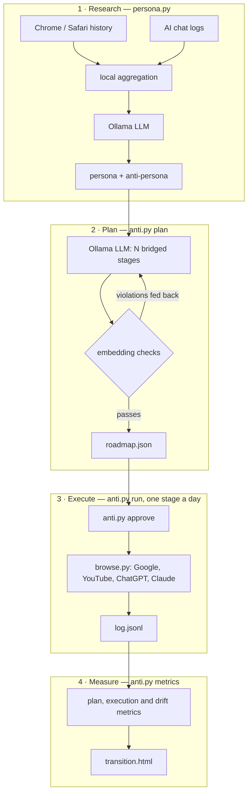

# anti-persona

[](https://github.com/tonoyandev/web3lesson/actions/workflows/ci.yml)


Find out who your digital traces say you are, design your opposite, and drift
toward it one small, measured step a day.

anti-persona is a local-first pipeline:

1. **Research.** Reads your browser history and AI-assistant chats on your own
   machine and asks a local LLM to describe you (persona) and your mirror image
   (anti-persona).
2. **Plan.** Builds a roadmap of bridged stages from one to the other, e.g.
   *software development → how to relax after a hard day → the beauty of natural
   landscapes → stepping away from screens → living in nature*, and proves with
   embeddings that no step is abrupt.
3. **Execute.** After you approve, lives one stage a day in a real Chrome window:
   Google searches, YouTube videos, ChatGPT and Claude.ai conversations.
4. **Measure.** Tracks whether the plan is smooth, whether it ran, and whether
   the browser profile's own history actually drifted.

Everything runs on your computer. The LLM and the embeddings run in
[Ollama](https://ollama.com); no data is sent to any analytics or AI API.



## Contents

- [Quick start](#quick-start)
- [Commands](#commands)
- [How "gradual" is measured](#how-gradual-is-measured)
- [Privacy and responsible use](#privacy-and-responsible-use)
- [Data the tools write](#data-the-tools-write)
- [Platform support](#platform-support)
- [Troubleshooting](#troubleshooting)
- [Contributing](#contributing)

## Quick start

Requirements: Python 3.10+, Google Chrome, [Ollama](https://ollama.com).

```bash
git clone https://github.com/tonoyandev/web3lesson.git anti-persona
cd anti-persona
pip3 install -r requirements.txt            # only dependency: playwright (drives your installed Chrome)
ollama pull qwen3.8                          # default LLM (~17 GB); see "Choosing a model" below
ollama pull nomic-embed-text                 # embeddings for the metrics (~270 MB)
```

Then:

```bash
python3 persona.py                           # 1. research: shows what it will read, asks for consent
python3 anti.py plan                         # 2. roadmap (slow: minutes per attempt on a laptop)
python3 anti.py approve                      #    read it, approve it
python3 anti.py login                        # 3. once: log in to Google / ChatGPT / Claude yourself
python3 anti.py run                          #    live the next stage (asks before opening the browser)
python3 anti.py metrics --judge              # 4. numbers and out/transition.html
python3 anti.py schedule --at 20:00          #    optional: one stage every day from now on
```

`python3 anti.py run --dry-run` prints what the next stage will do without
opening anything. Start there.

### Choosing a model

| Model | Size | Notes |
|---|---|---|
| `qwen3.8` (default) | ~17 GB | best roadmaps in testing; ~20 min per plan attempt on a laptop |
| `qwen3:14b` | ~9 GB | good balance |
| `qwen3:8b` | ~5 GB | fast; expect more validation retries |

Pass it to any command: `python3 persona.py --model qwen3:8b`, `python3 anti.py plan --model qwen3:8b`.

## Commands

### `persona.py` — research

| Flag | Default | |
|---|---|---|
| `--yes` | | skip the consent prompt |
| `--extra DIR` | | folder containing a ChatGPT data export (`conversations.json`) |
| `--model` | `qwen3.8:latest` | Ollama model |
| `--lang` | `English` | language of the generated personas |
| `--no-llm` | | only collect statistics and draw charts |
| `--out DIR` | `out` | output folder |
| `--selftest` | | offline logic checks |

Reads, never modifies: Chrome history, Safari history (macOS), Claude Code
chats (`~/.claude/projects`), and optionally a ChatGPT export. Only an aggregate
(top domains, search terms, keywords, ~60 short prompt samples) reaches the
model. Writes `out/summary.json`, `out/persona.json`, `out/report.html`.

### `anti.py` — plan, run, measure

| Command | What it does |
|---|---|
| `plan` | asks the LLM for N stages, scores them, feeds violations back, keeps the best of 3 attempts |
| `plan --goal "a, b, c"` | replaces the anti-persona's work interests with your own destination, e.g. `"gardening, living in nature"` |
| `plan --stages 7` | number of stages (default 10, one per day) |
| `plan --check` | re-score a roadmap you edited by hand, no LLM |
| `approve` | shows the roadmap, its scores and the responsible-use notice; required for unattended runs |
| `login` | opens the automation profile so you can log in yourself; the tool never sees passwords |
| `run` | next stage; `--dry-run`, `--only google,youtube`, `--stage K`, `--all` (demo: every stage now, 1–3 min apart), `--fast` (smoke tests), `--yes` (no prompt, approved roadmaps only), `--force` (ignore the one-stage-a-day guard) |
| `metrics` | plan, execution and drift metrics; `--judge` adds the independent observer (1–2 min) |
| `schedule` | daily launchd job at `--at HH:MM`; `--remove` stops it |
| `selftest` | offline logic checks |

`browse.py` can run one channel on its own, which is the fastest way to fix a
selector after a site redesign:

```bash
python3 browse.py google "test" --fast
```

## How "gradual" is measured

Every text is embedded with `nomic-embed-text`. The persona's interest phrases
and the anti-persona's define an axis, and any text gets a **position** on it:
0 is the persona, 1 is the anti-persona.

For unit vectors `e`, persona centroid `p` and anti-persona centroid `a`:

```
t(e) = (cos(e,a) − cos(e,p)) / (2·(1 − cos(p,a))) + 0.5
```

rescaled so that the mean of the persona's own phrases is 0 and the
anti-persona's is 1.

| Metric | Definition | Target |
|---|---|---|
| neighbour similarity | cosine between the centroids of stages k and k+1 | ≥ 0.5 |
| max step | largest position jump between neighbours | ≤ 2/(N−1) |
| backslides | stages that move back toward the persona by more than 0.05 | 0 |
| coverage | anti-persona interests reached (cosine ≥ 0.55) in the second half | ≥ 70% |
| execution rate | successful actions / attempted actions | ≥ 0.9 |
| challenge rate | runs stopped by a login wall or bot check | 0 |
| observed position | position of what was actually seen: page titles, chat replies | follows the plan |
| judge progress | a separate LLM call reads only the automation profile's history, names 6 interests, they are placed on the axis | ≥ 0.6 at the end |

`plan` turns every miss into a concrete instruction for the next attempt
("stage 3 sits at 49% of the way, target 22%: make it closer to the persona").

Re-running the research is deliberately **not** used to measure drift: your
main history doesn't change, and a sampled LLM varies more between two runs than
ten days of drift would.

## Privacy and responsible use

**Your data stays local.** History databases are copied to a temp folder and
read there. Nothing is uploaded. All generated files are git-ignored.

**Consent first.** `persona.py` lists every source and its size before reading.
Nothing runs unattended until you `approve` a roadmap; editing a stage revokes
the approval.

**Read the terms of the services you automate.** Automating the ChatGPT and
Claude.ai web apps is against OpenAI's and Anthropic's terms of use, and the
logged-in accounts can be flagged. Their APIs would not shape an account's
memory, which is why the web apps are used. Leave them out with
`run --only google,youtube`. Only use this on accounts you own.

**No evasion.** Login walls, consent pages, CAPTCHAs and "unusual traffic" pages
stop the run with exit code 2. They are never solved, bypassed or retried
through. Pacing is human (typing 60–180 ms per key, 20–90 s reading) and capped
at one stage (~11 actions) per day.

**Separate profile.** The browser runs in `~/.anti/profile` (`chmod 700`),
never in your everyday Chrome profile.

Only analyse data that is yours. Do not run this on someone else's computer or
accounts.

## Data the tools write

| Path | Content |
|---|---|
| `out/summary.json` | aggregated research statistics |
| `out/persona.json` | persona and anti-persona |
| `out/report.html` | research dashboard |
| `out/transition.html` | transition dashboard |
| `state/roadmap.json` | the plan and its scores; previous plans kept as `roadmap-<id>.json` |
| `state/log.jsonl` | every action with its result; this *is* the progress state |
| `state/metrics.jsonl` | one line per measurement |
| `~/.anti/profile/` | the automation Chrome profile and its logins |

To start over: delete `out/`, `state/` and `~/.anti/profile`, and run
`python3 anti.py schedule --remove`.

## Platform support

| | macOS | Linux | Windows |
|---|---|---|---|
| Chrome history | ✅ | ✅ | ✅ |
| Safari history | ✅ (needs Full Disk Access for the terminal) | – | – |
| Browser automation | ✅ | ✅ | ✅ |
| `schedule` | ✅ launchd | prints a cron line | – (use Task Scheduler) |

Developed and tested on macOS. Linux and Windows paths are implemented but less
tested; reports welcome.

## Troubleshooting

- **Safari is skipped.** Give your terminal app Full Disk Access in System
  Settings → Privacy & Security.
- **"This browser or app may not be secure" on Google sign-in.** Run Google and
  YouTube logged out; the local history the metrics read is recorded either way.
- **A chat channel fails every time.** The site changed its markup. Update the
  selector in the `SEL` dict at the top of `browse.py` and test with
  `python3 browse.py chatgpt "ping" --fast`. A failing action is skipped after
  two tries, so one broken channel never stalls the roadmap.
- **`plan` is slow or never valid.** Try `--model qwen3:14b`, fewer `--stages`,
  or edit `state/roadmap.json` by hand and run `plan --check`.
- **`run` says the stage is "due in N h".** One stage per 12 h keeps the drift
  gradual. `--force` overrides.

## Project structure

```
persona.py   research: collectors, aggregation, persona prompt, report
anti.py      planner, embedding metrics, state, CLI, schedule, transition report
browse.py    Playwright channels; the only module that imports playwright
```

Standard library only, plus Playwright for the browser.

## Contributing

Issues and pull requests are welcome. Before opening a PR:

```bash
python3 persona.py --selftest
python3 anti.py selftest
```

CI runs both on Python 3.10 and 3.13. Keep the dependency list at one entry,
keep new behaviour covered by the selftests, and never commit anything from
`out/` or `state/`.

Ideas for next versions: more AI chat export formats, a Windows scheduler,
Firefox history, stage insertion when a single jump keeps failing validation.

## License

[MIT](LICENSE)
