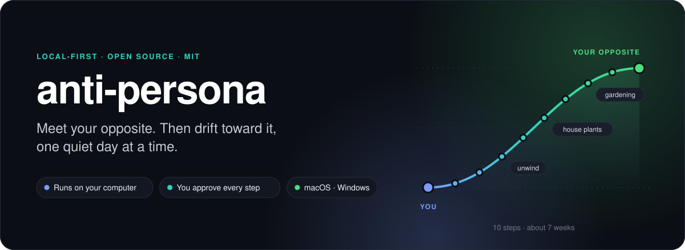
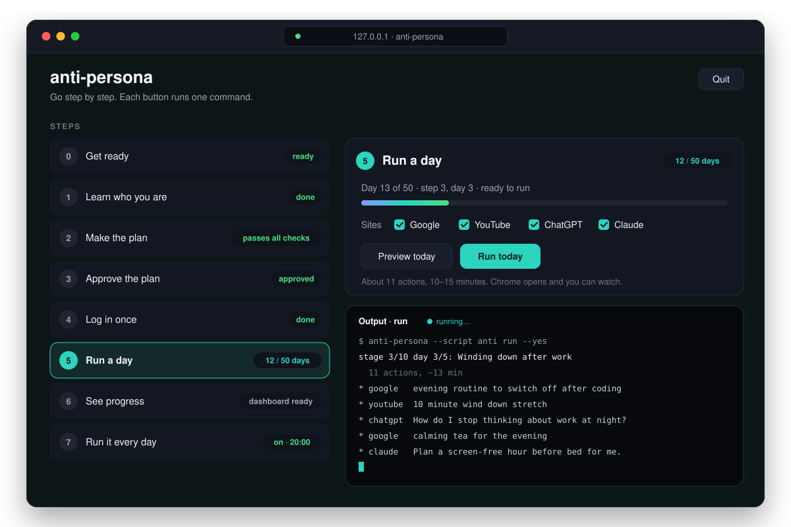
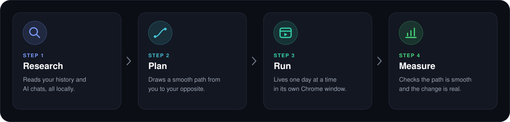
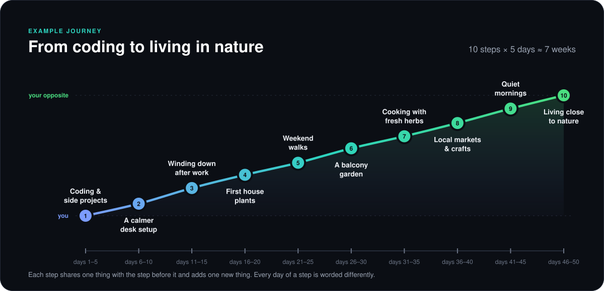
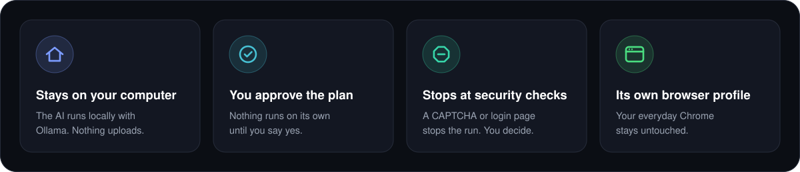
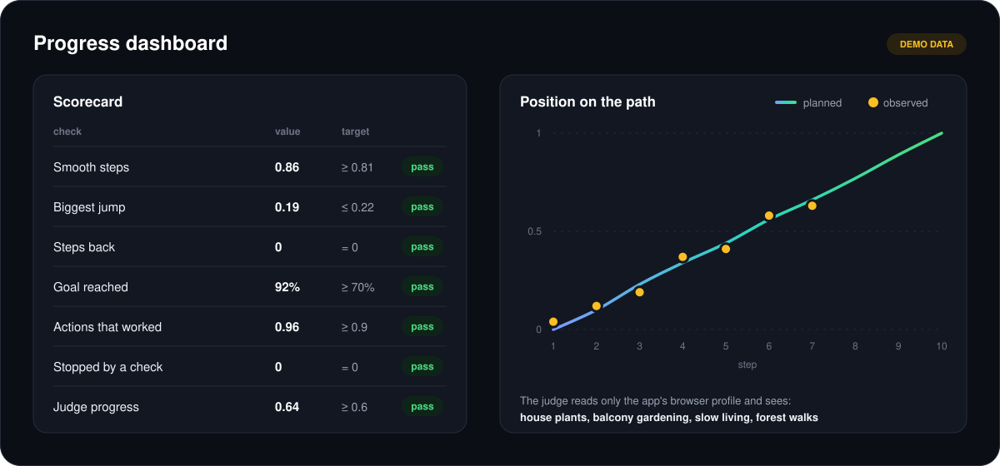
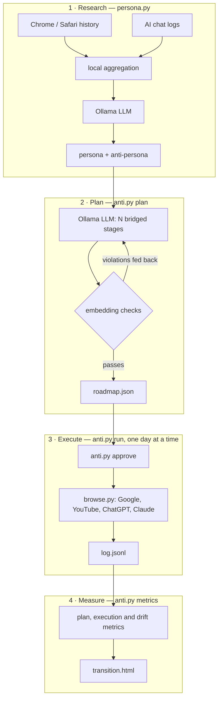

<p align="center">
  
</p>

<p align="center">
  <a href="https://github.com/tonoyandev/web3lesson/releases/latest"></a>
  &nbsp;
  <a href="https://github.com/tonoyandev/web3lesson/releases/latest"></a>
</p>

<p align="center">
  <a href="https://github.com/tonoyandev/web3lesson/releases/latest"></a>
  <a href="https://github.com/tonoyandev/web3lesson/actions/workflows/ci.yml"></a>
  
  
</p>

<p align="center">
  <b>Your browser history and AI chats say who you are.</b><br>
  anti-persona reads them on your own computer, finds your opposite,<br>
  and walks you there in small, natural steps.
</p>

---

## See it in action

<p align="center">
  
</p>
<p align="center"><sub>The app runs in your browser. Every step is a button. Illustration with demo data.</sub></p>

## How it works

<p align="center">
  
</p>

1. **Research.** A local AI reads a summary of your history and chats and describes two people: you, and your opposite.
2. **Plan.** It draws a path between them in 10 small steps. Each step shares something with the one before, so nothing feels sudden.
3. **Run.** Once you approve, it lives one day of the path at a time in its own Chrome window. It searches Google, watches YouTube, and asks the AIs you chose (ChatGPT, Claude, Gemini) questions, like a person at that step would.
4. **Measure.** It checks that the path is smooth and that the change really shows up.

## One step at a time

<p align="center">
  
</p>

Real people change slowly, so the app does too. Each step lasts 5 days and is
worded a little differently every day. The whole trip takes about seven weeks.
You can make it faster or slower.

**You choose which AIs see the change.** The app finds out which ones you use:
the ChatGPT or Claude desktop app, local chats from Claude Code or the Gemini
command line, or just the website, from your browser history. Tick the ones you
want, or none to use only Google and YouTube.

Every plan is made for the person who runs it. A programmer, a teacher and a
nurse each get their own path. Want a destination of your own instead of the
mirror image? Type it in, for example *"house plants, gardening, living in nature"*.

## Get started

**1. Install two free apps.**
[Google Chrome](https://www.google.com/chrome/) and [Ollama](https://ollama.com/download).
Open Ollama once, so it keeps running in the background.

**2. Download anti-persona** for your computer from the
[latest release](https://github.com/tonoyandev/web3lesson/releases/latest), then unzip it.

| Your computer | File |
|---|---|
| Mac with Apple Silicon (M1 or newer) | `anti-persona-macos-apple-silicon.zip` |
| Windows 10 or 11, 64-bit | `anti-persona-windows-x64.zip` |

**3. Open it and follow the buttons.** The first step downloads the AI models
for you. You need about 18 GB of free space for the default model.

<details>
<summary><b>First launch on a Mac</b></summary>

1. Drag `anti-persona.app` into **Applications**.
2. Open it once. macOS blocks it, because the app is not signed.
3. Go to **System Settings → Privacy & Security** and click **Open Anyway**.

Your data is kept in `~/Library/Application Support/anti-persona`.
</details>

<details>
<summary><b>First launch on Windows</b></summary>

1. Open the `anti-persona` folder and double-click `anti-persona.exe`.
2. If "Windows protected your PC" appears, click **More info**, then **Run anyway**.
3. Keep the black window open while you use the app.

Your data is kept in `%APPDATA%\anti-persona`.
</details>

<details>
<summary><b>Intel Mac, Linux, or you prefer the source code</b></summary>

You need Python 3.10 or newer, Google Chrome and Ollama.

```bash
git clone https://github.com/tonoyandev/web3lesson.git anti-persona
cd anti-persona
pip3 install -r requirements.txt
```

Then start the app: double-click `Start.command` on a Mac or `Start.bat` on
Windows, or run `python3 app.py`. On Linux, `python3 app.py` works too.

The first time on a Mac, right-click `Start.command` and choose **Open**.

Prefer the terminal? Every button is a plain command:

```bash
python3 persona.py                  # 1. learn who you are
python3 anti.py plan                # 2. make the plan (slow)
python3 anti.py approve             # 3. read and approve it
python3 anti.py login               # 4. log in once, yourself
python3 anti.py run --dry-run       # 5. see what today would do
python3 anti.py run                 #    and do it
python3 anti.py metrics --judge     # 6. check progress
python3 anti.py schedule --at 20:00 # 7. run it every day
```

When you run from source, your data stays next to the code in `out/` and `state/`.
</details>

## Safe by design

<p align="center">
  
</p>

Please read before you start:

- **Only use it on your own computer and your own accounts.**
- **ChatGPT, Claude and Gemini do not allow bots on their websites.** Your accounts could be flagged. Choose which AIs take part in step 2 of the app, or none to use only Google and YouTube.
- **It never tries to get past a security check.** A CAPTCHA or a login page stops the run and leaves it to you.
- **It uses its own Chrome profile.** Your everyday Chrome and its history stay untouched.

## Questions

<details>
<summary><b>How long does it take?</b></summary>

About seven weeks with the default plan of 10 steps × 5 days. At most one day
runs every 12 hours, and a day takes 10–15 minutes. You can change the days per
step in step 2 of the app, and your approval and progress are kept.
</details>

<details>
<summary><b>My computer is small. Which AI model should I use?</b></summary>

Pick one in the app's first step:

| Model | Download size | Speed and quality |
|---|---|---|
| `qwen3.8` (default) | 17 GB | best plans, slowest: about 20 minutes per plan attempt |
| `qwen3:14b` | 9 GB | good balance |
| `qwen3:8b` | 5 GB | fastest, needs more retries |
</details>

<details>
<summary><b>Which AIs does it work with?</b></summary>

ChatGPT, Claude and Gemini, through their websites. Step 1 checks which ones you
use and shows why, for example:

| AI | What it looks for |
|---|---|
| ChatGPT | the desktop app, visits to chatgpt.com |
| Claude | the desktop app, Claude Code chats, visits to claude.ai |
| Gemini | the desktop app if there is one, Gemini command-line chats, visits to gemini.google.com |

If it finds no app and no local chats but you visit the site, it says you use
the web version. You can tick any AI, found or not. If you change your choice
after approving a plan, approve it again; your progress is kept.
</details>

<details>
<summary><b>What exactly does it read?</b></summary>

Chrome history, Safari history on a Mac, Claude Code chats, and a ChatGPT data
export if you add one. It never changes these files. The AI never sees your raw
history either, only a summary: top sites, page titles, searches, active hours,
keywords, and 30 short prompt samples. The app shows every file and its size
before it starts, and waits for your yes.
</details>

<details>
<summary><b>Does anything leave my computer?</b></summary>

No. The AI runs on your computer with Ollama. The only things that go online
are the searches, videos and chats of the plan itself, and you approve those
first. The app listens only on your own computer, behind a secret address that
changes every time you open it.
</details>

<details>
<summary><b>How do I stop, or start over?</b></summary>

Turn off the daily run in step 7, or press **Quit**. To start over, delete your
data folder (see "First launch" above) and `~/.anti/`, which holds the app's
own Chrome profile.
</details>

---

## Under the hood

<p align="center">
  
</p>
<p align="center"><sub>The progress dashboard. Illustration with demo data.</sub></p>

The sections below are for the curious and for contributors. You don't need
them to use the app.

<details>
<summary><b>The pipeline</b></summary>


</details>

<details>
<summary><b>Research</b></summary>

`persona.py` reads these sources and never changes them:

- Chrome history on macOS, Linux and Windows, plus extra profiles with `--chrome-history`
- Safari history on macOS
- Claude Code chats in `~/.claude/projects`
- a ChatGPT data export, with `--extra DIR`

It also checks which AI assistants you use, and saves the result in
`summary.json`: desktop apps in the usual install folders, the number of Claude
Code and Gemini command-line chat files, and visits to chatgpt.com, claude.ai
and gemini.google.com in your browser history. Only exact domains count, so
look-alike sites don't. Gemini command-line chats are counted, not read.

The model never sees your raw history. The tool first boils it down to a
summary: top domains, page titles, search terms, the hours you are active,
keywords, and 30 short prompt samples. Only that summary goes to the model.

The prompt tells the model three things. Browser history describes your whole
life, while AI chats mostly describe your job. Every claim needs evidence from
the data. The opposite must flip each trait one to one.
</details>

<details>
<summary><b>Planning</b></summary>

The model writes all stages in one go. It sees the whole trip at once, which
helps keep an even pace. Two rules guide it:

- **Bridge rule.** Each stage shares one concrete thing with the stage before
  it, and adds one new thing that moves toward the goal.
- **Pace rule.** Stage *k* should be *(k−1)/(N−1)* of the way, so stage 1 is 0%
  and stage 10 is 100%.

The tool then checks the plan with the measurements below. If a check fails, it
tells the model exactly what went wrong, for example "stage 3 sits at 49% of the
way, target 22%". It tries up to 3 times and keeps the best plan.
</details>

<details>
<summary><b>The math</b></summary>

Every text is turned into a vector with `nomic-embed-text`. The persona's
interests and the opposite's interests are two points. The line between them is
an **axis**. Any text gets a **position** on that axis, where 0 is you and 1 is
your opposite.

For unit vectors, with `e` the text, `p` the persona centre and `a` the opposite
centre:

```
t(e) = (cos(e,a) − cos(e,p)) / (2·(1 − cos(p,a))) + 0.5
```

This is the projection of `e` onto the line from `p` to `a`. The result is then
rescaled, so that your own interest phrases average 0 and the opposite's
average 1.

**Plan checks**

| Check | What it means | Target |
|---|---|---|
| neighbour similarity | how alike two neighbouring stages are | higher than the first and last stage's similarity + 0.05 |
| max step | the biggest jump between two neighbours | at most 2/(N−1) |
| backslides | stages that move back toward you by more than 0.05 | 0 |
| coverage | share of the opposite's interests reached in the second half, with a cosine of at least 0.55 | at least 70% |

**Why the similarity check is relative.** Lists of search queries always look
alike to an embedding model. Neighbours score above 0.8 even in a bad plan, so a
fixed threshold would never fail. Instead, neighbours must be clearly closer
than the start is to the finish.

**Run checks**

| Check | What it means | Target |
|---|---|---|
| execution rate | actions that worked, out of actions tried | at least 0.9 |
| challenge rate | runs stopped by a login page or bot check | 0 |
| observed position | position of what was really seen: page titles and chat replies | follows the plan line |
| judge progress | a separate model call reads only the automation profile's history, names 6 interests, and places them on the axis | at least 0.6 at the end |

**Why drift is not measured by re-running the research.** Your main history
barely changes, and a model gives slightly different answers every time. That
noise is bigger than ten days of real drift. The judge looks only at the
automation profile, so it measures just the change the tool made.
</details>

<details>
<summary><b>Pacing</b></summary>

- Day 1 of a stage uses the plan's own actions.
- Every later day, the model rewords the stage once. The topic stays the same,
  the wording and angle are new, and the number of actions is kept. The new
  wording is saved in `state/variants.json`, so a retry repeats it exactly.
- At most one day runs every 12 hours. A day is about 11 actions and takes
  10–15 minutes.
- Typing takes 60–180 ms per key, and reading takes 20–90 seconds per page.

A Google account that is logged in to both your normal browser and the
automation profile sees both. The change only looks complete once your own
habits change too.
</details>

<details>
<summary><b>State and safety details</b></summary>

- **The log is the progress.** `state/log.jsonl` records every action. A run
  that stops halfway continues where it stopped, and it never repeats a
  finished action. An action that fails twice is skipped, so one broken site
  cannot block the plan.
- **Approval is tied to the plan.** The plan's id is a hash of its stages.
  Editing a stage cancels the approval. So does changing which AIs the plan
  talks to, because that changes which services it touches. Changing only the
  pace keeps it. Progress is keyed by the stages alone, so a new AI choice
  never loses it.
- **Only the chosen AIs get prompts.** The plan asks the model for prompts only
  for the AIs you picked. An AI added after planning reuses the plan's general
  chat prompts until you make a new plan.
- **One run at a time.** A lock file, `~/.anti/run.lock`, stops two runs from
  opening the same Chrome profile, which would corrupt it. A lock left by a
  crash is cleaned up automatically.
- **History copies are temporary.** History databases are copied to a private
  temp folder together with their journal and WAL files, read in read-only mode,
  and then deleted.
- **Untrusted text.** Page titles come from websites. They are passed to the
  model as quoted data, with an instruction to ignore any commands inside. Both
  HTML reports escape every value, so a bad page title cannot run code.
- **The app's local page.** It listens on `127.0.0.1` only. Every request needs
  a token that is new on each launch and a `127.0.0.1` or `localhost` Host
  header, which keeps out other websites, DNS rebinding and other users of the
  same computer. Buttons map to a fixed list of commands with checked values,
  never a shell.
- **About bot detection.** Chrome starts without the "controlled by automated
  software" banner and without the `navigator.webdriver` flag. Nothing else is
  done: no fingerprint spoofing, no proxies, no CAPTCHA solving.
- **Remote model warning.** If `--host` points to another computer, the tool
  warns you, because your summary would then leave your machine.
- **Permissions.** `~/.anti` holds your logins and is set to `chmod 700`.
</details>

<details>
<summary><b>The packaged app</b></summary>

The download is `app.py` frozen with [PyInstaller](https://pyinstaller.org),
together with Python and Playwright. It drives the Chrome you installed, so no
browser is bundled. It is built by `.github/workflows/release.yml` on GitHub's
macOS and Windows machines every time a release is published. The build runs
all three selftests inside the finished app before attaching it.

A few things work differently inside it:

- **No Python and no `.py` files.** The app runs its own parts through itself:
  `anti-persona --script anti selftest` is the same as `python3 anti.py selftest`.
  Every button, the daily schedule and the command line use this.
- **Data lives in a user folder.** The app's own folder is read-only (macOS) or
  replaced on update, so `out/` and `state/` go to the folder shown on the page.
  Set `ANTI_HOME` to use a different one.
- **Models download over Ollama's HTTP API**, so the `ollama` command does not
  have to be on the PATH, which a Finder-launched app does not have.
- **Daily runs need a fixed location.** macOS runs an app from Downloads from a
  random temporary path. The schedule refuses until the app is in Applications.
- **Safari history** needs Full Disk Access for the app itself: System Settings
  → Privacy & Security → Full Disk Access → add `anti-persona.app`.

Build it yourself:

```bash
pip3 install pyinstaller -r requirements.txt
```

```bash
pyinstaller --noconfirm --windowed --name anti-persona --hidden-import browse app.py
```

On Windows, use `--console` instead of `--windowed`.
</details>

<details>
<summary><b>Files it writes</b></summary>

| Path | What is inside |
|---|---|
| `out/summary.json` | the research summary |
| `out/persona.json` | you and your opposite |
| `out/report.html` | research dashboard |
| `out/transition.html` | progress dashboard |
| `state/roadmap.json` | the plan and its scores; old plans are kept as `roadmap-<id>.json` |
| `state/log.jsonl` | every action and its result |
| `state/variants.json` | the daily rewordings |
| `state/metrics.jsonl` | one line per measurement |
| `~/.anti/profile/` | the app's own Chrome profile |

`out/` and `state/` live next to the code when you run from source, and in the
user data folder in the packaged app. They hold personal data and are
git-ignored.
</details>

<details>
<summary><b>All commands</b></summary>

**`persona.py`**

| Flag | What it does |
|---|---|
| `--yes` | skip the permission question |
| `--extra DIR` | add a ChatGPT data export |
| `--chrome-history FILE` | add another Chrome profile; can be repeated |
| `--model NAME` | Ollama model; default `qwen3.8:latest` |
| `--host URL` | Ollama address; default `http://localhost:11434` |
| `--lang LANG` | language of the report; default English |
| `--no-llm` | only statistics and charts |
| `--out DIR` | output folder; default `out/` in the data folder |
| `--selftest` | run the built-in checks |

**`anti.py`**

| Command | What it does |
|---|---|
| `plan` | make a plan; `--stages N` (default 10), `--days-per-stage N` (default 5), `--ais chatgpt,gemini` or `none`, `--goal "a, b"`, `--attempts N` |
| `ais` | show which AIs were found and which take part; `--set chatgpt,claude,gemini` or `none` |
| `plan --check` | re-score a plan you edited by hand; can also change `--days-per-stage` |
| `approve` | review and approve the plan |
| `login` | open the app's Chrome profile to log in |
| `run` | run the next day; `--dry-run`, `--only google,youtube,gemini`, `--stage K`, `--all` (demo), `--fast` (testing), `--yes`, `--force` |
| `metrics` | measure progress; `--judge` adds the independent check |
| `pull` | download `--model` through Ollama |
| `daily` | what the scheduler runs: `run --yes`, then `metrics --judge` |
| `schedule` | run daily at `--at HH:MM`; `--remove` to stop |
| `selftest` | run the built-in checks |

**`app.py`**: `--port N`, `--no-browser`, `--selftest`.

**`browse.py`** runs one site on its own, which is the quickest way to fix a
site after a redesign:

```bash
python3 browse.py chatgpt "ping" --fast
```
</details>

<details>
<summary><b>Platforms</b></summary>

| | macOS | Linux | Windows |
|---|---|---|---|
| Packaged app download | ✅ Apple Silicon | – | ✅ x64 |
| App from source (`Start.command` / `Start.bat` / `python3 app.py`) | ✅ | ✅ | ✅ |
| Chrome history | ✅ | ✅ | ✅ |
| Safari history | ✅ (needs Full Disk Access) | – | – |
| Browser automation | ✅ | ✅ | ✅ |
| Daily schedule | ✅ launchd | prints a cron line | ✅ Task Scheduler |

It is built and tested on macOS. Linux and Windows should work but are less
tested.
</details>

<details>
<summary><b>Troubleshooting</b></summary>

- **macOS won't open the app or `Start.command`.** See "First launch on a Mac"
  above. For `Start.command`, right-click it and choose Open. If it says
  "permission denied", run `chmod +x Start.command` once.
- **Windows says "Windows protected your PC".** Click "More info", then "Run
  anyway".
- **Safari is skipped.** Give the app, or your terminal when you run from
  source, Full Disk Access in System Settings under Privacy & Security.
- **Google says "this browser may not be secure".** Use Google and YouTube
  without logging in. The history is recorded either way.
- **A chat site fails every time.** The site changed its layout. Update its
  selector in `SEL` at the top of `browse.py`, then test it with the command
  above.
- **Making the plan is slow or never passes.** Try a smaller model, fewer
  steps, or edit `state/roadmap.json` by hand and run `plan --check`.
- **"due in N h".** Only one day runs every 12 hours. `--force` skips this rule.
- **"busy: another run holds the profile".** Two runs overlapped. Wait for the
  first one to finish.
</details>

<details>
<summary><b>Code layout</b></summary>

```
app.py       the click-through app (and the entry point of the packaged app)
persona.py   research, summary, persona prompt, report
anti.py      planning, math, state, commands, scheduling, progress report
browse.py    the browser; the only file that needs playwright
docs/        the images in this README
```

It uses only the Python standard library, plus Playwright for the browser.
</details>

## Contributing

Issues and pull requests are welcome. Please run the checks first:

```bash
python3 persona.py --selftest
```

```bash
python3 anti.py selftest
```

```bash
python3 app.py --selftest
```

CI runs them on Python 3.10 and 3.13. Keep the dependency list short, and
never commit anything from `out/` or `state/`.

Ideas for next versions: more chat export formats, Firefox history, an Intel
Mac build.

## License

[MIT](LICENSE)
